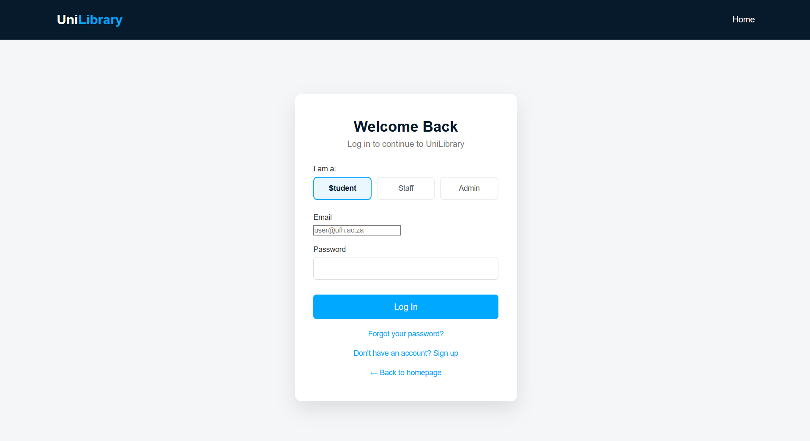
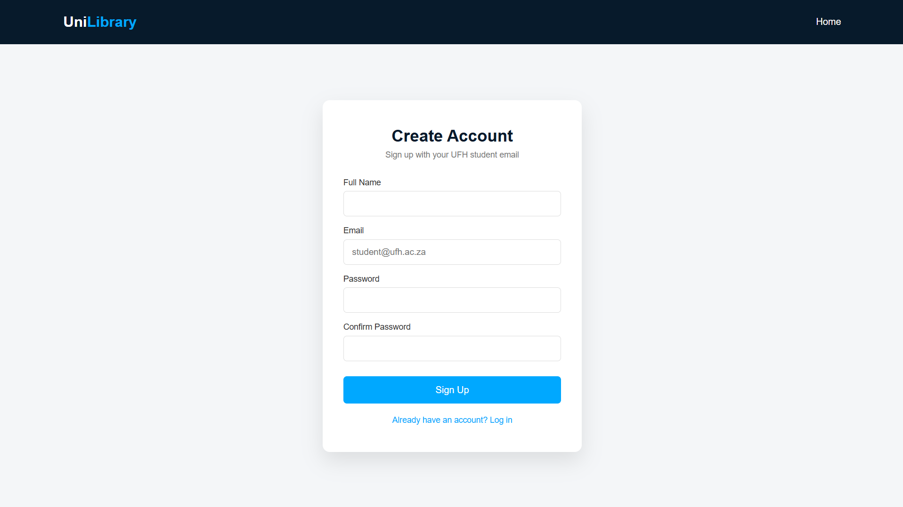
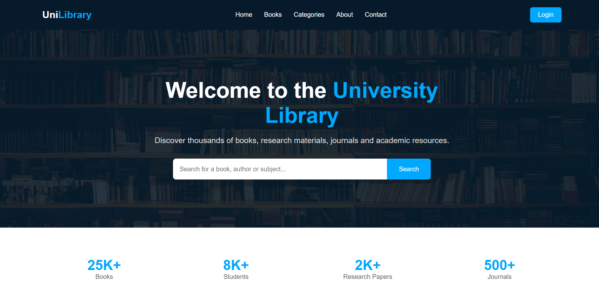
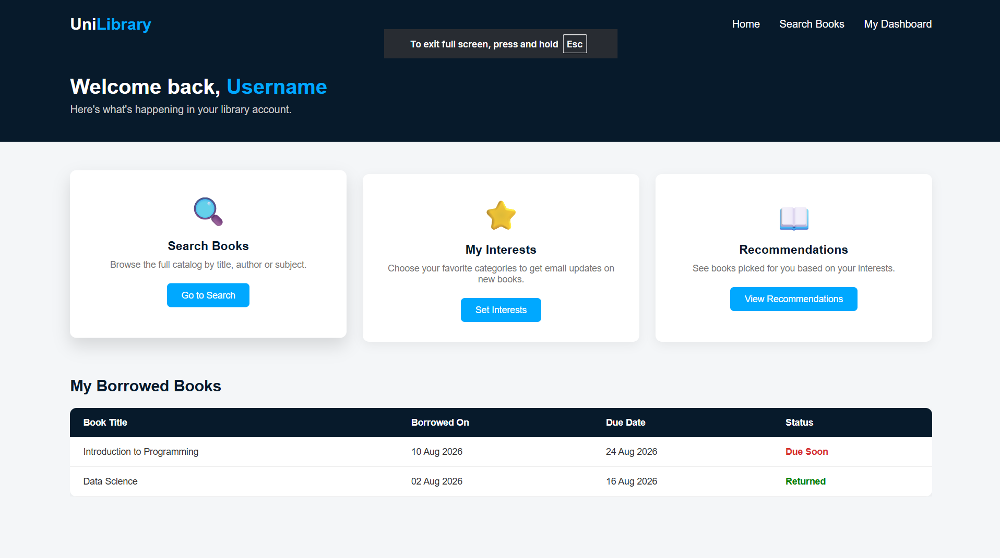
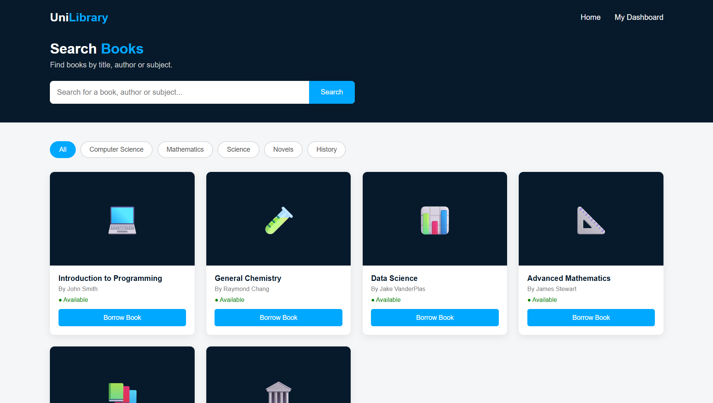
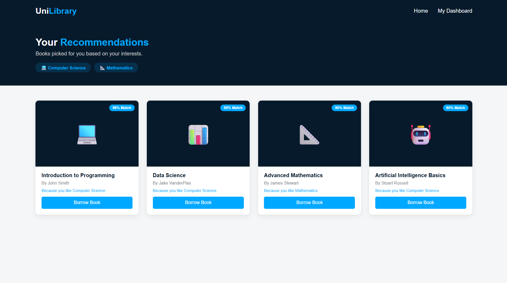
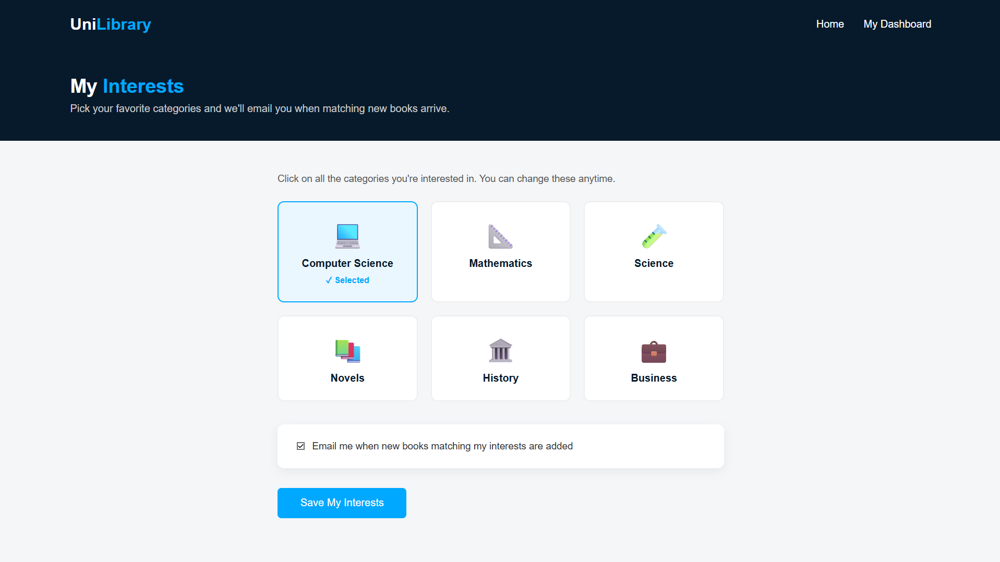
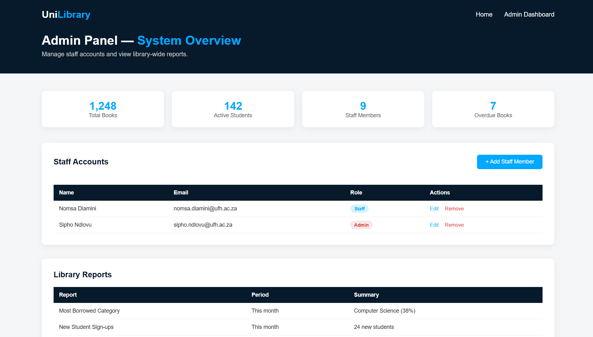
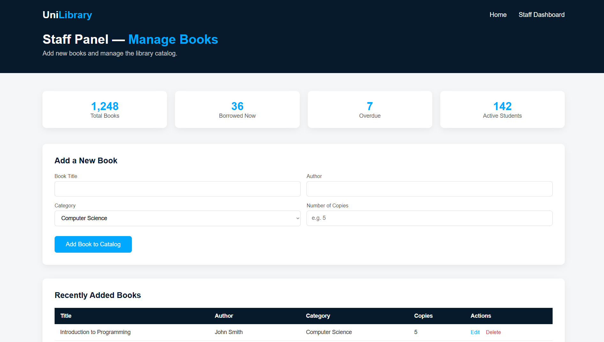

# SmartShelf — UniLibrary

> **Capstone Collaborative Project** is a collaborative software development project for both CSC 200 & CSC 300 students, the project is focused on the design and implementation of **UniLibrary**, a library management and personalized book recommendation system for the university community.

## About the Project

SmartShelf is a development collaboration group of focused on the design, development, programming, and implementation of a real-world **Library Management and Book Recommendation System**.

The project aims to provide a modern, efficient, and user-friendly platform that addresses the needs of both university students and library staff.

The application, **UniLibrary**, is designed to streamline essential library operations while improving the way students discover, access, and interact with academic resources. The system brings together library management functionality and intelligent recommendation features within a single platform.

## UniLibrary

UniLibrary is designed to simplify the management and accessibility of library resources, including **books, journals, academic materials, and lecture resources**.

The system provides library staff with tools to efficiently manage resources and maintain accurate stock information, while giving students a convenient platform through which they can search for and discover relevant academic material.

A key component of UniLibrary is its **personalized recommendation system**. The application uses algorithms to analyze factors such as:

* User reading patterns
* Previous borrowing and reading history
* User preferences
* Book ratings and reviews
* Book popularity
* Search and interaction history

These factors are used to generate recommendations that are more relevant to individual users and their academic interests.

## Core Functionality

UniLibrary is designed to provide functionality including:

* **Library Resource Management** — Management and organization of books and other academic resources.
* **Advanced Book Search** — Search and filter resources using relevant attributes and criteria.
* **Personalized Recommendations** — Recommend resources based on individual user behaviour and preferences.
* **Reading and Borrowing History** — Maintain records of user interactions with library resources.
* **Ratings and Reviews** — Allow users to provide feedback that can contribute to the recommendation process.
* **Resource Availability** — Provide information regarding the availability of library materials.
* **Reservations and Borrowing** — Support interactions between users and available library resources.
* **Notifications** — Provide users with relevant system and library notifications.
* **Staff Management Tools** — Assist library staff with managing resources, stock, and library operations.

## Project Objective

The primary objective of SmartShelf is to develop a reliable and practical library management solution that addresses common challenges faced by students and library staff.

### For Students

UniLibrary aims to make academic resources easier to discover and access while providing personalized recommendations that can help students find material relevant to their studies.

### For Library Staff

The system aims to reduce the complexity of managing library resources by providing centralized tools for maintaining inventory, monitoring resources, and managing everyday library operations.

Ultimately, SmartShelf seeks to combine **library management, intelligent search, and personalized recommendations** into one cohesive system, creating a more efficient and accessible digital library experience for the university community.

## Application Preview

The following section contains screenshots of the UniLibrary application as development progresses.

### Login & Signup





### Home



### Student Dashboard



### Book Search



### Recommendations




### Interests



### Library Management





## Repository Structure

The repository contains the application, documentation, testing resources, development workflows, and supporting configuration files.

```text
SmartShelf/
├── .github/
│   └── workflows/              # GitHub Actions workflows
│
├── docs/                       # Project-level documentation
│   ├── api.md
│   ├── databaseDesign.md
│   ├── deployment.md
│   ├── requirements.md
│   └── system-design.md
│
├── smart-library-system/       # Main UniLibrary application
│   ├── css/                    # Application stylesheets
│   ├── database/               # Application database resources
│   ├── docs/                   # Application-specific documentation
│   ├── *.html                  # User-facing application pages
│   └── src/                    # Application source code
│       ├── books/
│       ├── borrowing/
│       ├── notifications/
│       ├── recommendations/
│       ├── reservations/
│       ├── smartself/
│       ├── static/
│       ├── templates/
│       └── users/
│
├── tests/                      # Project tests
├── .env.example                # Example environment configuration
├── .gitignore                  # Git ignore rules
├── CONTRIBUTING.md             # Contribution guidelines
├── LICENSE                     # Project license
├── README.md                   # Project overview
└── requirements.txt            # Project dependencies
```

> The repository structure is actively maintained and may evolve as the UniLibrary system develops.

## Technologies

The project uses **HTML** for the web interface.

The application also contains Python-based source code and project dependencies, with the complete technology stack and supporting frameworks documented as the system architecture is finalized.

Additional technologies will be documented here as they are incorporated into the project.

## Documentation

Project documentation is maintained primarily within the [`/docs`](docs/) directory.

Current documentation includes:

* **Requirements** — System requirements and specifications
* **System Design** — System architecture and design
* **Database Design** — Database structure and design decisions
* **API Documentation** — Application programming interface documentation
* **Deployment** — Deployment-related information

Additional technical documentation may be added as development progresses.

## Development

The project includes automated GitHub Actions workflows for development-related tasks, including testing.

Contributors should follow the development practices and contribution guidelines described in [`CONTRIBUTING.md`](CONTRIBUTING.md).

## Contributors

| Contributor   | Role          |
| ------------- | ------------- |
| *To be added* | *To be added* |
| *To be added* | *To be added* |
| *To be added* | *To be added* |

The contributor list and project roles will be maintained as the development team progresses.

## Contributing

UniLibrary is developed collaboratively by the SmartShelf project team.

Before contributing, please review [`CONTRIBUTING.md`](CONTRIBUTING.md) for information regarding the project's development workflow, contribution practices, and repository guidelines.

## 📄 License

This project is licensed under the terms specified in the [`LICENSE`](LICENSE) file.
