# SmartShelf Entity Relationship Diagram

This model separates a catalogue title (`BOOK`) from its physical inventory
(`BOOK_COPY`). A loan is always made against a physical copy, while a
reservation is made against a title so that the next suitable returned copy can
be allocated fairly.

```mermaid
erDiagram
    APP_USER ||--o{ USER_ROLE : has
    ROLE ||--o{ USER_ROLE : grants
    APP_USER ||--o| STUDENT_PROFILE : may_have
    APP_USER ||--o| STAFF_PROFILE : may_have
    FACULTY ||--o{ DEPARTMENT : contains
    DEPARTMENT ||--o{ PROGRAMME : offers
    DEPARTMENT ||--o{ STAFF_PROFILE : belongs_to
    PROGRAMME ||--o{ STUDENT_PROFILE : studies
    APP_USER ||--o{ ADMIN_ROLE_REQUEST : submits
    APP_USER o|--o{ ADMIN_ROLE_REQUEST : reviews
    APP_USER ||--o{ PASSWORD_RESET_TOKEN : requests
    APP_USER ||--o{ USER_SESSION : opens
    APP_USER ||--o{ USER_INTEREST : selects
    INTEREST ||--o{ USER_INTEREST : is_selected

    BOOK ||--o{ BOOK_COPY : has
    BOOK ||--o{ BOOK_AUTHOR : credits
    AUTHOR ||--o{ BOOK_AUTHOR : writes
    BOOK ||--o{ BOOK_CATEGORY : classified_as
    CATEGORY ||--o{ BOOK_CATEGORY : classifies
    BOOK ||--o{ BOOK_SUBJECT : covers
    SUBJECT ||--o{ BOOK_SUBJECT : describes
    BOOK ||--o{ BOOK_KEYWORD : indexed_by
    KEYWORD ||--o{ BOOK_KEYWORD : indexes

    APP_USER ||--o{ LOAN : borrows
    BOOK_COPY ||--o{ LOAN : is_loaned_in
    APP_USER o|--o{ LOAN : records_issue
    APP_USER o|--o{ LOAN : records_return
    APP_USER ||--o{ RESERVATION : places
    BOOK ||--o{ RESERVATION : is_reserved
    BOOK_COPY o|--o{ RESERVATION : allocates
    APP_USER ||--o{ BOOK_RATING : gives
    BOOK ||--o{ BOOK_RATING : receives
    APP_USER ||--o{ NOTIFICATION : receives
    LOAN o|--o{ NOTIFICATION : triggers
    APP_USER ||--o{ RECOMMENDATION : receives
    BOOK ||--o{ RECOMMENDATION : suggests
    APP_USER o|--o{ AUDIT_LOG : performs
```

## Cardinality notes

- An `APP_USER` may have no profile, one `STUDENT_PROFILE`, or one
  `STAFF_PROFILE`; a verified member should have the profile appropriate to
  their normal role.
- An `APP_USER` can have several roles over time. `USER_ROLE` records who
  granted each role. An active `ADMIN` role is granted only after an approved
  `ADMIN_ROLE_REQUEST`.
- A `BOOK` can exist before stock is acquired, so it may have zero physical
  copies. Each `BOOK_COPY` belongs to exactly one book.
- A `LOAN` has exactly one borrower and one copy. A partial unique constraint
  prevents a copy from having more than one active loan.
- A `RESERVATION` has exactly one user and one book. It may be allocated a copy
  only when the reservation becomes ready.
- Each user may submit only one rating for a given book. Application logic must
  first verify a completed or current loan for that book.
